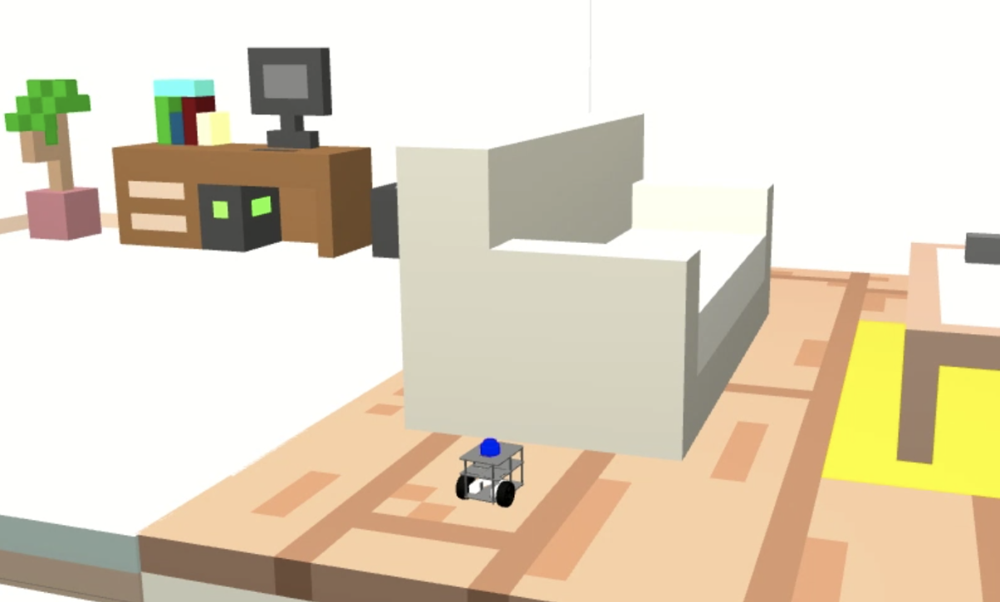
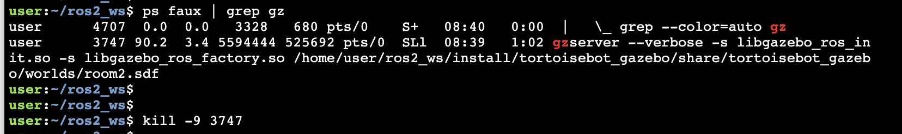

# Checkpoint 23 — FastBot Waypoints (ROS 2 Tests)

ROS 2 C++ **waypoint action server** with **GTest node-level tests** for the **FastBot** differential-drive robot. The `fastbot_action_server` drives the robot toward a 2D `geometry_msgs/Point` goal by alternating between a *fix-yaw* state (face the goal) and a *go-to-point* state (drive forward). Two GTest cases then check that the **final position** and **final yaw** fall within tolerance when the action reports success. Built for **Task 2** of the Checkpoint 23 grading guide, which expects both a passing and a failing run to be reproducible from this README.

<p align="center">
  
</p>

## How It Works

### Action Interface (`action/Waypoint.action`)

```text
# Goal
geometry_msgs/Point position
---
# Result
bool success
---
# Feedback
geometry_msgs/Point position
string state
```

### Action Server (`fastbot_action_server.cpp`)

1. Advertises the `fastbot_as` action on startup and subscribes to `/fastbot/odom` for pose feedback
2. On goal receipt, extracts `(x, y)` from the goal, reads the current pose, and runs a small state machine:
   - **`fix yaw`** — rotates in place (`cmd_vel.angular.z`) until `|desired_yaw − current_yaw| ≤ yaw_precision`
   - **`go to point`** — drives straight (`cmd_vel.linear.x`) until `hypot(dx, dy) ≤ dist_precision`
   - **`idle`** — publishes a zero twist and returns `success = true`
3. Publishes `geometry_msgs/Twist` on `/fastbot/cmd_vel` throughout

### Node-Level Tests (`test/test_waypoints.cpp`)

Two GTest cases wired through `ament_cmake_gtest`:

| Test | What it checks |
|---|---|
| `EndPositionTest` | Sends a goal via `fastbot_as`, waits for the result, then asserts the final `[x, y]` from `/fastbot/odom` is within `error_margin` of the goal |
| `EndYawTest` | Computes the desired yaw as `atan2(goal_y − start_y, goal_x − start_x)` and asserts the final yaw is within `tol` of it |

Both tests share a fixture that waits for the action server and the first odometry message before sending the goal.

### Tolerances (as committed)

| Parameter | Value | Notes |
|---|---|---|
| Position tolerance `error_margin` | `0.20 m` | 20 cm radius around the goal |
| Yaw tolerance `tol` | `10 · π rad` | Deliberately huge — always passes as-is; tighten to provoke a failure |
| Result wait in `wait_for_result()` | `60 s` | Cut down to `1 s` to force a timeout-style error |
| Action-server wait | `10 s` | Fails the fixture if `fastbot_as` isn't up |

## ROS 2 Interface

| Name | Type | Direction | Description |
|---|---|---|---|
| `fastbot_as` | `fastbot_waypoints/action/Waypoint` | action server | Goal / feedback / result endpoint |
| `/fastbot/odom` | `nav_msgs/Odometry` | sub | Pose source for both server and tests |
| `/fastbot/cmd_vel` | `geometry_msgs/Twist` | pub | Velocity command |

## Project Structure

```
fastbot_waypoints/
├── action/
│   └── Waypoint.action
├── include/fastbot_waypoints/
├── src/
│   └── fastbot_action_server.cpp
├── test/
│   └── test_waypoints.cpp
├── media/
├── CMakeLists.txt
└── package.xml
```

## How to Use

### Prerequisites

- ROS 2 Humble (+ `ament_cmake_gtest`)
- Gazebo (bundled with the `fastbot_gazebo` sim)
- `rclcpp`, `rclcpp_action`, `geometry_msgs`, `nav_msgs`, `tf2`, `tf2_geometry_msgs`

### Build

```bash
cd ~/ros2_ws
colcon build --packages-select fastbot_waypoints
source install/setup.bash
```

### Launch the simulation

```bash
# Terminal 1 — FastBot + world in Gazebo
source ~/ros2_ws/install/setup.bash
ros2 launch fastbot_gazebo one_fastbot_room.launch.py
```

If Gazebo hangs, kill any lingering `gzserver` processes:

```bash
ps faux | grep gz
kill -9 <process_id>
```

<p align="center">
  
</p>

### Run the action server

```bash
# Terminal 2
source ~/ros2_ws/install/setup.bash
ros2 run fastbot_waypoints fastbot_action_server
```

### Run the tests

```bash
# Terminal 3
cd ~/ros2_ws && colcon build --packages-select fastbot_waypoints
source install/setup.bash
colcon test --packages-select fastbot_waypoints --event-handler=console_direct+
colcon test-result --all
```

## Pass / Fail Scenarios

Three knobs in `test/test_waypoints.cpp` decide whether the tests pass or fail. Each produces the summary line shown below.

### Passing run — both tests green

Use the default goal `(2.00, 1.25)`:

```cpp
double goal_x = 2.00;
double goal_y = 1.25;
```

```
Summary: 2 tests, 0 errors, 0 failures, 0 skipped
```

### Failing run — position mismatch

Switch the goal to one of the fail pairs. The robot's final `(x, y)` will be outside the `0.20 m` tolerance:

```cpp
double goal_x = 0.50;
double goal_y = 0.00;
```

### Failing run — timeout

Reduce the result wait so the future expires before the action finishes:

```cpp
auto status = result_future.wait_for(1s);
```

### Failing run — yaw mismatch

Tighten the yaw tolerance so small heading noise breaks the assertion:

```cpp
const double per_step = M_PI / 180.0;  // 1 degree
const double tol      = 10.0 * per_step;  // 10 degrees
```

Expected summary for any of the failing runs:

```
Summary: 2 tests, 1 errors, 0 failures, 1 skipped
```

### Rebuild + re-test each time you tweak the test file

```bash
cd ~/ros2_ws && colcon build --packages-select fastbot_waypoints
source install/setup.bash
colcon test --packages-select fastbot_waypoints --event-handler=console_direct+
colcon test-result --all
```

### Sanity checks

```bash
ros2 action list | grep fastbot_as
ros2 topic echo /fastbot/odom --once
ros2 topic echo /fastbot/cmd_vel
```

## Key Concepts Covered

- **ROS 2 action server** in C++ (`rclcpp_action`) with a custom `.action` interface
- **Yaw from quaternion** via `tf2::Matrix3x3::getRPY` for state-machine control
- **Node-level GTest** wired through `ament_cmake_gtest` — action-client fixture + odom subscription
- **Deterministic pass/fail reproduction** by editing goal coordinates, result timeouts, and angular tolerances
- **`colcon test` + `colcon test-result`** workflow for graded test runs

## Technologies

- ROS 2 Humble
- C++ 17 (`rclcpp`, `rclcpp_action`, `nav_msgs`, `geometry_msgs`, `tf2`)
- GTest via `ament_cmake_gtest`
- FastBot differential-drive robot in Gazebo
